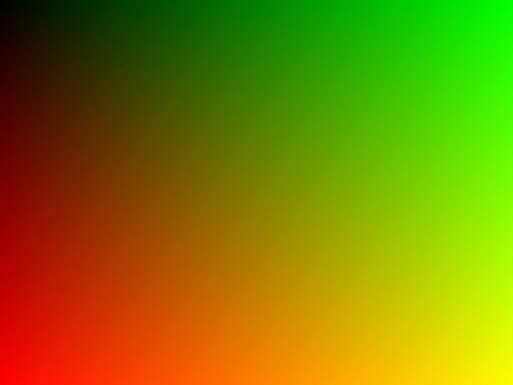
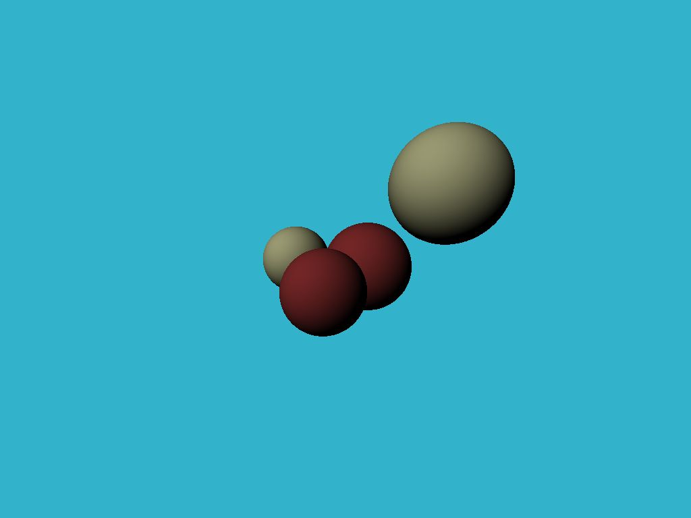
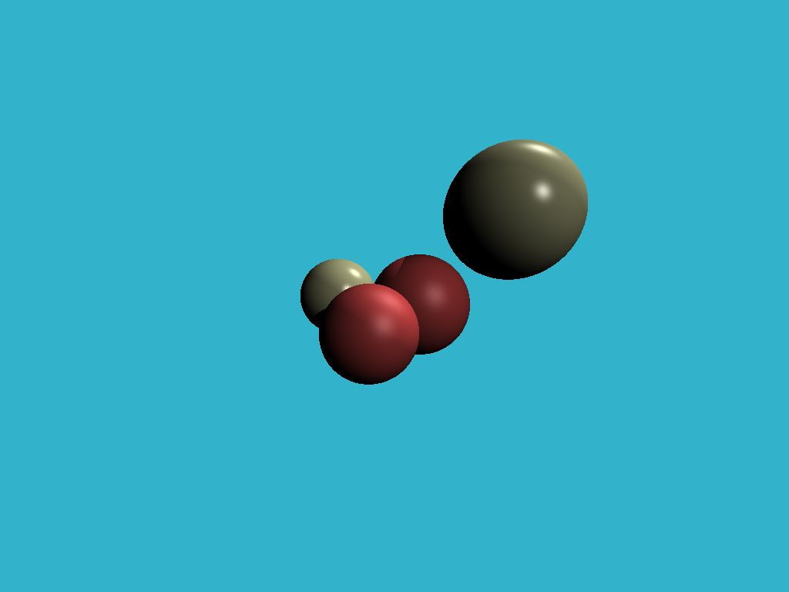

# Toy Raytracer

An experimental raytracer to understand raycasting, lighting, shadows, reflections, and more.

Based on the [tinyraytracer](https://github.com/ssloy/tinyraytracer) project by [ssloy](https://github.com/ssloy).

## Coloring the Canvas

## Diffuse Lighting

## Specular Lighting

